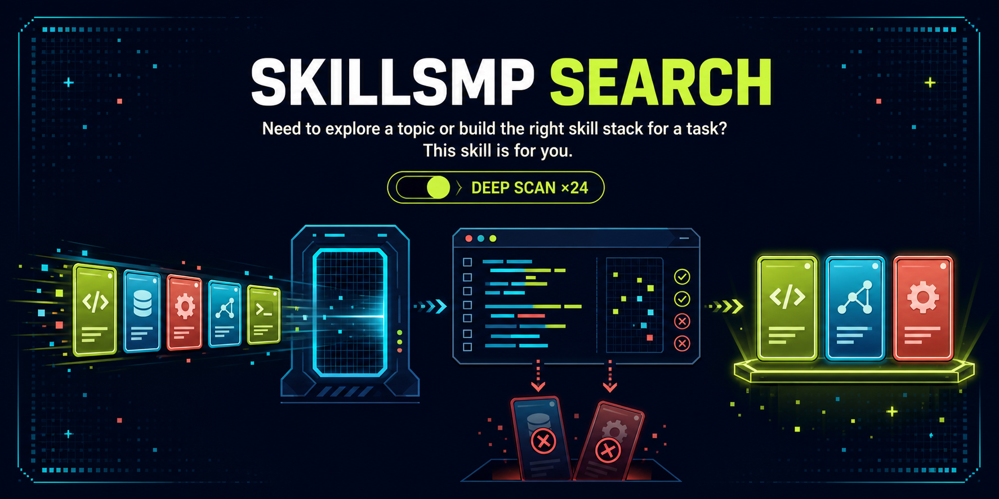

<p align="center">
  
</p>

# SkillsMP Search

[](https://github.com/FixAdmin/skillsmp-search/actions/workflows/validate.yml)
[](https://agentskills.io)
[](https://nodejs.org/)
[](LICENSE)

> **Need to explore a topic or build the right skill stack for a task? This skill is for you.**

Marketplace metadata can find candidates. SkillsMP Search reads the source, removes duplicates, compares the methods, and tells you what is actually useful.

## What it does

- Turns your need into short, focused SkillsMP queries.
- Reads each finalist's complete `SKILL.md` instead of trusting the listing.
- Looks for a useful method delta, not a polished description of familiar advice.
- Groups duplicates, forks, and stale sources before scoring.
- Explains why the winner fits, where it falls short, and when to use an alternative.
- Never runs code from candidate repositories during evaluation.

<p align="center">
  
</p>

## Install

The easiest route works across the Agent Skills ecosystem:

```bash
npx skills add FixAdmin/skillsmp-search
```

The installer detects supported agents and asks where to place the skill. You can target one explicitly:

```bash
npx skills add FixAdmin/skillsmp-search --agent codex
npx skills add FixAdmin/skillsmp-search --agent claude-code
npx skills add FixAdmin/skillsmp-search --agent cursor
```

Project installation is the default. Add `--global` only when you deliberately want the skill in every project.

The shared `SKILL.md` format is portable. The search runtime requires Node.js 18 or newer and network access to SkillsMP and GitHub.

## Try it

Ask your agent naturally:

```text
Find me skills for writing prompts and developer documentation.
```

Or ask for the deeper pass explicitly:

```text
Use heavy mode to find skills for evaluating production AI agents.
```

Heavy mode never activates just because a topic looks difficult. You have to ask for `heavy`, `deep search`, `глубокий поиск`, or equivalent maximum-depth wording.

## Standard and heavy mode

| | Standard | Heavy |
|---|---:|---:|
| Trigger | Normal skill-search request | Explicit request only |
| Queries | 3-5 | 10-12 |
| Sort passes | `stars` | `stars` + `recent` |
| API requests | 3-5 | 20-24 |
| Candidate pool | Up to 40 | Up to 250 after merging |
| Fully inspected finalists | 6-8 | 20-25 |
| Recommendations | 3-5 | 5-8 |

See a [standard search example](examples/standard-search.md) and a [heavy search example](examples/heavy-search.md).

## How recommendations earn their place

Each inspected finalist receives a content score out of 100:

| Signal | Weight | Question |
|---|---:|---|
| Task fit | 30 | Does it solve the requested problem in this environment? |
| Useful method delta | 30 | Does it change decisions or execution beyond baseline model knowledge? |
| Current AI-native alignment | 20 | Does it use practical, maintained agent methods? |
| Actionability | 10 | Can an agent follow the workflow with available tools? |
| Validation | 10 | Does it include checks, feedback, or recovery? |

A polished skill with no meaningful method delta cannot score above 60.

## Run the search script directly

Most people should invoke the skill through their agent. For debugging or integration, the bundled CLI prints JSON:

```bash
node skills/skillsmp-search/scripts/search-skillsmp.mjs \
  --query '"prompt engineering"' \
  --query 'developer documentation' \
  --limit-per-query 20 \
  --max-candidates 40
```

Windows users can keep the familiar PowerShell entry point. It calls the same Node implementation:

```powershell
& skills/skillsmp-search/scripts/search-skillsmp.ps1 `
  -Query @('"prompt engineering"', 'developer documentation') `
  -LimitPerQuery 20 `
  -MaxCandidates 40
```

Set `SKILLSMP_API_KEY` in your environment for authenticated limits. The script never writes or prints the key.

## API budget

[SkillsMP currently documents](https://skillsmp.com/docs/api) these limits:

- Anonymous: 10 requests per minute and 50 per day.
- Authenticated: 30 requests per minute and 500 per day.

One maximum heavy search uses 24 requests. That is 4.8% of the authenticated daily allowance.

## Compatibility

The repository follows the [Agent Skills specification](https://agentskills.io/specification). The [`skills` CLI](https://github.com/vercel-labs/skills) can place it for Codex, Claude Code, Cursor, GitHub Copilot, OpenCode, and many other supported agents.

Basic skill instructions transfer well. Agent-specific tools do not. This project therefore promises a portable format and a cross-platform Node runtime, not identical behavior in every agent.

The release checks Node on Windows, macOS, and Linux. The PowerShell wrapper is an optional Windows convenience.

## Contributing

Found a stale source rule, ranking edge case, or clearer way to explain a recommendation? Contributions are welcome. Start with [CONTRIBUTING.md](CONTRIBUTING.md).

For security problems, please follow [SECURITY.md](SECURITY.md) instead of opening a public issue.

## License

SkillsMP Search is available under the [MIT License](LICENSE).
